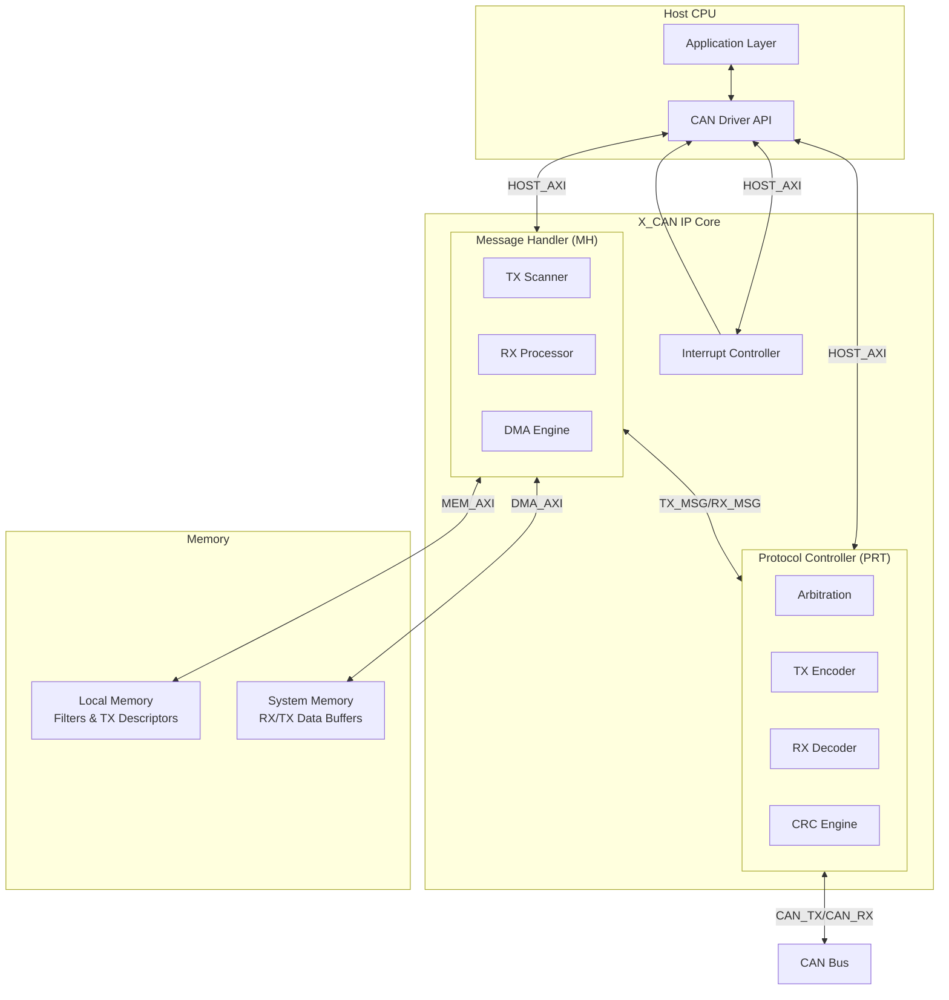

# CAN XL Driver

**Production-Ready CAN CC/FD/XL Controller Driver**

Based on Bosch X_CAN IP v3.9 User Manual specifications.
Conforms to ISO11898-1:2015 and CiA610-1.

[]()
[]()

---

## Features

- **Multi-Protocol Support**: CAN Classic, CAN FD (64 bytes), CAN XL (2048 bytes)
- **8 TX/RX FIFO Queues**: Independent message buffering
- **32 TX Priority Queue Slots**: High-priority message handling
- **Hardware Timestamping**: 64-bit timestamps for all messages
- **Advanced Filtering**: Up to 255 RX filter elements
- **Safety Features**: Descriptor CRC, timeout watchdogs, memory protection
- **Interrupt-Driven**: Callback-based event notification
- **MISRA-C:2012 Compliant**: Production-ready code quality

---

## Architecture Overview



---

## File Structure

```
CAN_Driver/
├── can_driver.h          # Public API header
├── can_driver.c          # Driver implementation
├── README.md             # This file
├── docs/
│   └── manual.md         # Detailed technical manual
├── examples/
│   ├── basic_tx_rx.c     # Basic transmit/receive example
│   ├── canfd_example.c   # CAN FD high-speed example
│   ├── canxl_example.c   # CAN XL large payload example
│   └── loopback_test.c   # Self-test without hardware
└── tests/
    ├── test_init.c       # Initialization tests
    ├── test_tx.c         # TX functionality tests
    ├── test_rx.c         # RX functionality tests
    └── test_error.c      # Error handling tests
```

---

## Quick Start

### 1. Include the Driver

```c
#include "can_driver.h"
```

### 2. Configure and Initialize

```c
can_config_t config = {0};

/* Base addresses */
config.base_addr = CAN_BASE;           /* Controller registers */
config.lmem_base_addr = 0x40010000;    /* Local memory */

/* Protocol selection */
config.protocol = CAN_PROTOCOL_FD;     /* CAN FD mode */

/* Bit timing for 500 kbit/s nominal, 2 Mbit/s data */
config.nominal_timing.brp = 4;
config.nominal_timing.tseg1 = 63;
config.nominal_timing.tseg2 = 16;
config.nominal_timing.sjw = 16;

config.data_timing.brp = 0;
config.data_timing.tseg1 = 15;
config.data_timing.tseg2 = 4;
config.data_timing.sjw = 4;
config.data_timing.tdco = 16;

/* Queue configuration */
config.tx_fifo_queues[0].enabled = true;
config.tx_fifo_queues[0].start_addr = 0x80000000;
config.tx_fifo_queues[0].size = 16;

config.rx_fifo_queues[0].enabled = true;
config.rx_fifo_queues[0].start_addr = 0x80001000;
config.rx_fifo_queues[0].size = 32;
config.rx_fifo_queues[0].dc_size = 2;  /* 64 bytes */

/* Enable interrupts */
config.func_int_enable = 0x000001FF;   /* TX/RX FIFO interrupts */

/* Initialize */
can_error_t status = can_init(&config);
```

### 3. Transmit a Message

```c
uint8_t data[] = {0x11, 0x22, 0x33, 0x44, 0x55, 0x66, 0x77, 0x88};

status = can_tx_fifo_push(CAN_BASE, 0, 0x123, data, 8, true, false, false);
```

### 4. Receive a Message

```c
can_msg_t rx_msg;

status = can_rx_read(CAN_BASE, 0, &rx_msg, 1000);
if (status == CAN_ERROR_NONE) {
    printf("Received ID: 0x%X, Length: %u\n", rx_msg.id, rx_msg.len);
}
```

---

## API Summary

| Function | Description |
|----------|-------------|
| `can_init()` | Initialize controller with configuration |
| `can_deinit()` | Stop and deinitialize controller |
| `can_start()` | Start controller operation |
| `can_stop()` | Stop controller operation |
| `can_tx_fifo_push()` | Send message via TX FIFO |
| `can_tx_priority_slot()` | Send via priority queue slot |
| `can_rx_read()` | Read received message |
| `can_irq_handler()` | Process interrupts |
| `can_get_stats()` | Get error counters and status |
| `can_set_loopback()` | Enable/disable loopback mode |

See [docs/manual.md](docs/manual.md) for complete API reference.

---

## Supported Platforms

- **QNX Neutrino** 7.x
- **Linux** (with appropriate memory mapping)
- **Bare-metal** (ARM Cortex-M/A, RISC-V)
- Any platform with memory-mapped I/O support

---

## Requirements

- C11 compiler (GCC, Clang, IAR, ARM Compiler)
- 32-bit or 64-bit architecture
- Memory-mapped access to CAN controller registers
- DMA-capable system memory for descriptors

---

## Documentation

- **[Technical Manual](docs/manual.md)** - Complete API reference and integration guide
- **[X_CAN User Manual v3.9](docs/xcan_user_manual_v390.pdf)** - Hardware reference

---

## License

Copyright © 2026. All rights reserved.
Proprietary software - contact for licensing terms.

---

## Version History

| Version | Date | Changes |
|---------|------|---------|
| 1.0.0 | 2026-01-18 | Initial release |
