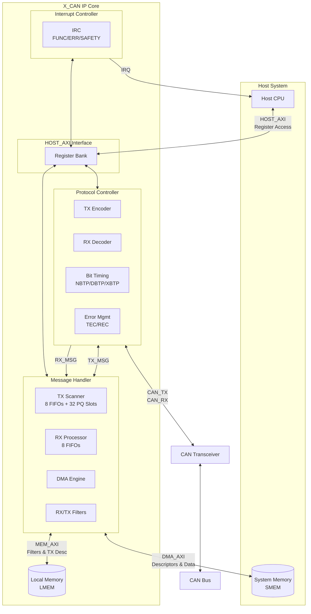
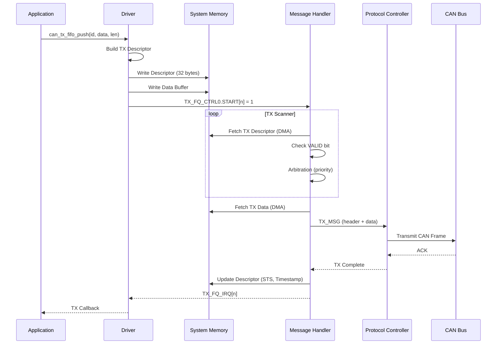
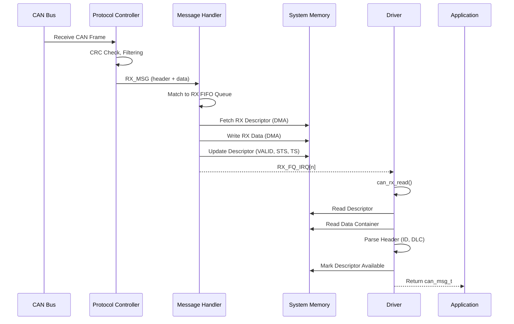

# CAN XL Driver Technical Manual

**Version 1.0.0** | **January 2026**

Based on Bosch X_CAN IP v3.9 User Manual

---

## Table of Contents

1. [Architecture Overview](#1-architecture-overview)
2. [Integration Guide](#2-integration-guide)
3. [API Reference](#3-api-reference)
4. [Configuration Guide](#4-configuration-guide)
5. [TX/RX Data Flow](#5-txrx-data-flow)
6. [Troubleshooting](#6-troubleshooting)
7. [Testing Guide](#7-testing-guide)
8. [MISRA-C Compliance](#8-misra-c-compliance)

---

## 1. Architecture Overview

### 1.1 System Block Diagram



### 1.2 Memory Map

| Region | Offset | Size | Description |
|--------|--------|------|-------------|
| MH Registers | 0x000 - 0x8FF | 2304 bytes | Message Handler registers |
| IRC Registers | 0x900 - 0x9FF | 256 bytes | Interrupt Controller registers |
| PRT Registers | 0xA00 - 0xAFF | 256 bytes | Protocol Controller registers |

### 1.3 Key Register Groups

```
CAN_BASE + 0x000  MH_VERSION     Release identification
CAN_BASE + 0x004  MH_CTRL        Message Handler control (START bit)
CAN_BASE + 0x008  MH_CFG         Configuration (INST_NUM, MAX_RETRANS)
CAN_BASE + 0x00C  MH_STS         Status (BUSY, ENABLE, CLOCK_ACTIVE)
CAN_BASE + 0x010  MH_SFTY_CFG    Safety timeouts (DMA/MEM/PRT_TO_VAL)
CAN_BASE + 0x014  MH_SFTY_CTRL   Safety enables (CRC, timeouts)

CAN_BASE + 0x120  TX_FQ_ADD_PT0  TX FIFO Queue 0 address pointer
CAN_BASE + 0x124  TX_FQ_START_ADD0  TX FIFO Queue 0 start address
CAN_BASE + 0x128  TX_FQ_SIZE0    TX FIFO Queue 0 size

CAN_BASE + 0x420  RX_FQ_ADD_PT0  RX FIFO Queue 0 address pointer
CAN_BASE + 0x424  RX_FQ_START_ADD0  RX FIFO Queue 0 start address
CAN_BASE + 0x428  RX_FQ_SIZE0    RX FIFO Queue 0 size

CAN_BASE + 0x900  FUNC_RAW       Functional interrupt status
CAN_BASE + 0x920  FUNC_ENA       Functional interrupt enable
CAN_BASE + 0x910  FUNC_CLR       Functional interrupt clear

CAN_BASE + 0xA08  PRT_STAT       Protocol status (TEC, REC, LEC)
CAN_BASE + 0xA44  PRT_CTRL       Protocol control (START, STOP, RESET)
CAN_BASE + 0xA60  PRT_MODE       Operating mode (FDOE, XLOE, MON)
CAN_BASE + 0xA64  NBTP           Nominal bit timing
CAN_BASE + 0xA68  DBTP           Data phase bit timing (FD)
CAN_BASE + 0xA6C  XBTP           XL phase bit timing
```

---

## 2. Integration Guide

### 2.1 Build System Integration

#### Makefile Example

```makefile
# CAN Driver Makefile

CC = gcc
CFLAGS = -Wall -Wextra -pedantic -std=c11 -O2
CFLAGS += -DCAN_BASE=0x40000000

# For QNX
ifeq ($(PLATFORM),qnx)
    CC = qcc
    CFLAGS += -Vgcc_ntoaarch64
endif

# Source files
SRCS = can_driver.c
OBJS = $(SRCS:.c=.o)

# Library output
LIBNAME = libcan_driver.a

all: $(LIBNAME)

$(LIBNAME): $(OBJS)
	$(AR) rcs $@ $^

%.o: %.c can_driver.h
	$(CC) $(CFLAGS) -c $< -o $@

clean:
	rm -f $(OBJS) $(LIBNAME)

.PHONY: all clean
```

#### CMake Example

```cmake
cmake_minimum_required(VERSION 3.16)
project(can_driver C)

set(CMAKE_C_STANDARD 11)
set(CMAKE_C_STANDARD_REQUIRED ON)

# Define CAN base address (platform-specific)
add_compile_definitions(CAN_BASE=0x40000000)

# Driver library
add_library(can_driver STATIC
    can_driver.c
    can_driver.h
)

target_include_directories(can_driver PUBLIC ${CMAKE_CURRENT_SOURCE_DIR})

# Compiler warnings
target_compile_options(can_driver PRIVATE
    -Wall -Wextra -pedantic
    $<$<CONFIG:Release>:-O2>
    $<$<CONFIG:Debug>:-g -O0>
)

# Example application
add_executable(can_example examples/basic_tx_rx.c)
target_link_libraries(can_example can_driver)
```

### 2.2 Memory Mapping

The CAN controller registers must be mapped to virtual memory before use.

#### Linux Example

```c
#include <fcntl.h>
#include <sys/mman.h>

#define CAN_PHYS_BASE  0x40000000
#define CAN_REG_SIZE   0x1000

volatile void *can_base;

int can_map_registers(void) {
    int fd = open("/dev/mem", O_RDWR | O_SYNC);
    if (fd < 0) {
        return -1;
    }
    
    can_base = mmap(NULL, CAN_REG_SIZE,
                    PROT_READ | PROT_WRITE,
                    MAP_SHARED, fd,
                    CAN_PHYS_BASE);
    
    close(fd);
    
    if (can_base == MAP_FAILED) {
        return -1;
    }
    
    return 0;
}

void can_unmap_registers(void) {
    if (can_base != NULL && can_base != MAP_FAILED) {
        munmap((void *)can_base, CAN_REG_SIZE);
    }
}
```

#### QNX Example

```c
#include <hw/inout.h>
#include <sys/mman.h>

#define CAN_PHYS_BASE  0x40000000
#define CAN_REG_SIZE   0x1000

volatile void *can_base;

int can_map_registers(void) {
    can_base = mmap_device_memory(NULL, CAN_REG_SIZE,
                                   PROT_READ | PROT_WRITE | PROT_NOCACHE,
                                   0, CAN_PHYS_BASE);
    
    if (can_base == MAP_FAILED) {
        return -1;
    }
    
    return 0;
}
```

### 2.3 DMA/System Memory Configuration

The driver uses System Memory (SMEM) for TX/RX descriptors and data buffers.

#### Memory Allocation Requirements

| Component | Size Formula | Alignment |
|-----------|--------------|-----------|
| TX Descriptor | 32 bytes | 32-byte |
| RX Descriptor | 16 bytes | 16-byte |
| TX Data Buffer | ceil(len/32) × 32 bytes | 32-byte |
| RX Data Container | DC_SIZE × 32 bytes | 32-byte |

#### Example: Allocating Queue Memory

```c
#include <stdlib.h>

#define TX_QUEUE_DEPTH  16
#define RX_QUEUE_DEPTH  32
#define RX_DC_SIZE      2   /* 64 bytes per container */

/* Allocate aligned memory for TX queue */
void *tx_queue_mem = aligned_alloc(32, TX_QUEUE_DEPTH * 32);

/* Allocate aligned memory for RX queue */
/* RX needs: descriptors (16 bytes each) + data containers */
size_t rx_desc_size = RX_QUEUE_DEPTH * 16;
size_t rx_data_size = RX_QUEUE_DEPTH * RX_DC_SIZE * 32;
void *rx_queue_mem = aligned_alloc(32, rx_desc_size + rx_data_size);

/* Configure driver */
config.tx_fifo_queues[0].start_addr = (uint32_t)(uintptr_t)tx_queue_mem;
config.tx_fifo_queues[0].size = TX_QUEUE_DEPTH;

config.rx_fifo_queues[0].start_addr = (uint32_t)(uintptr_t)rx_queue_mem;
config.rx_fifo_queues[0].size = RX_QUEUE_DEPTH;
config.rx_fifo_queues[0].dc_size = RX_DC_SIZE;
```

#### DMA Coherency

For systems with cache:

```c
/* Ensure cache coherency for DMA buffers */
#ifdef __linux__
    /* Use DMA-coherent allocation */
    void *dma_alloc_coherent(size_t size, dma_addr_t *phys_addr);
#endif

#ifdef __QNX__
    /* QNX: Use PROT_NOCACHE flag in mmap */
    void *buf = mmap(NULL, size, PROT_READ | PROT_WRITE | PROT_NOCACHE,
                     MAP_PRIVATE | MAP_ANON | MAP_PHYS, NOFD, 0);
#endif
```

---

## 3. API Reference

### 3.1 Initialization Functions

#### can_init

```c
can_error_t can_init(const can_config_t *config);
```

Initialize the CAN controller following the programming sequence from Manual Section 1.4.7.1.

**Parameters:**
| Name | Type | Description |
|------|------|-------------|
| config | `const can_config_t *` | Pointer to configuration structure |

**Returns:** `can_error_t`
- `CAN_ERROR_NONE` - Success
- `CAN_ERROR_INVALID_PARAM` - NULL config pointer
- `CAN_ERROR_TIMEOUT` - Clock not active or PRT start failed

**Initialization Sequence:**
1. Verify `MH_STS.CLOCK_ACTIVE = 1` (Section 1.4.7.1)
2. Perform PRT software reset (Section 1.5.5.2)
3. Configure MH global registers: `MH_CFG`, `AXI_PARAMS`
4. Configure safety timeouts: `MH_SFTY_CFG`, `MH_SFTY_CTRL`
5. Configure RX filter: `RX_FILTER_MEM_ADD`, `RX_FILTER_CTRL`
6. Configure RX FIFO queues: `RX_FQ_START_ADD{n}`, `RX_FQ_SIZE{n}`
7. Configure TX FIFO queues: `TX_FQ_START_ADD{n}`, `TX_FQ_SIZE{n}`
8. Configure PRT mode: `MODE` register (Section 1.5.5.3)
9. Configure bit timing: `NBTP`, `DBTP`, `XBTP`
10. Enable interrupts: `FUNC_ENA`, `ERR_ENA`, `SAFETY_ENA`
11. Start MH: Write `MH_CTRL.START = 1`
12. Start RX queues: `RX_FQ_CTRL2.ENABLE`, `RX_FQ_CTRL0.START`
13. Start PRT: Write `CTRL.STRT = 1`, poll `MH_STS.ENABLE`
14. Start TX queues: `TX_FQ_CTRL2.ENABLE`, `TX_FQ_CTRL0.START`

---

#### can_deinit

```c
can_error_t can_deinit(uint32_t base_addr);
```

Stop and deinitialize the CAN controller (Section 1.4.7.2).

**Parameters:**
| Name | Type | Description |
|------|------|-------------|
| base_addr | `uint32_t` | CAN controller base address |

**Returns:** `can_error_t`

**Deinitialization Sequence:**
1. Stop PRT: Write `CTRL.STOP = 1`
2. Wait for `MH_STS.ENABLE = 0`
3. Abort all TX FIFO queues
4. Abort all RX FIFO queues
5. Disable all queues
6. Stop MH: Write `MH_CTRL.START = 0`

---

### 3.2 Transmission Functions

#### can_tx_fifo_push

```c
can_error_t can_tx_fifo_push(uint32_t base_addr, uint8_t fifo_id,
                             uint32_t id, const uint8_t *data,
                             uint32_t len, bool fd, bool xl, bool remote);
```

Push a message to a TX FIFO queue (Section 1.4.7.6).

**Parameters:**
| Name | Type | Description |
|------|------|-------------|
| base_addr | `uint32_t` | CAN controller base address |
| fifo_id | `uint8_t` | TX FIFO queue index (0-7) |
| id | `uint32_t` | CAN identifier (11 or 29 bits) |
| data | `const uint8_t *` | Pointer to data payload |
| len | `uint32_t` | Data length (0-8 CC, 0-64 FD, 0-2048 XL) |
| fd | `bool` | True for CAN FD frame |
| xl | `bool` | True for CAN XL frame |
| remote | `bool` | True for remote frame (CC only) |

**Returns:** `can_error_t`
- `CAN_ERROR_NONE` - Message queued successfully
- `CAN_ERROR_INVALID_PARAM` - Invalid fifo_id or length
- `CAN_ERROR_QUEUE_FULL` - FIFO is full

**Descriptor Construction:**
1. Build Element 0: VALID=1, HD=1, IRQ=1, FQN=fifo_id
2. Build Element 1: SIZE (in 32-byte units), PLSRC=0
3. Build T0: ID, XTD, XLF, FDF flags
4. Build T1: DLC, RTR/BRS/ESI flags
5. Copy data to SMEM or pack in TD0/TD1
6. Write invalid marker at next position
7. Restart queue if stopped

---

#### can_tx_priority_slot

```c
can_error_t can_tx_priority_slot(uint32_t base_addr, uint8_t slot_id,
                                 uint32_t id, bool extended,
                                 const uint8_t *data, uint32_t len,
                                 bool fd, bool xl, bool brs);
```

Send a message via TX Priority Queue slot (Section 1.4.7.9-1.4.7.10).

**Parameters:**
| Name | Type | Description |
|------|------|-------------|
| slot_id | `uint8_t` | TX PQ slot index (0-31) |
| extended | `bool` | True for 29-bit extended ID |
| brs | `bool` | Bit Rate Switch (FD/XL only) |

**Returns:** `can_error_t`
- `CAN_ERROR_QUEUE_FULL` - Slot is busy

---

#### can_tx_abort

```c
can_error_t can_tx_abort(uint32_t base_addr, uint8_t fifo_id);
```

Abort a TX FIFO queue (Section 1.4.7.8).

---

### 3.3 Reception Functions

#### can_rx_fifo_setup

```c
can_error_t can_rx_fifo_setup(uint32_t base_addr, uint8_t fifo_id,
                              uint32_t desc_phys_addr, uint16_t max_desc,
                              uint32_t dc_size, bool continuous);
```

Configure an RX FIFO queue (Section 1.4.7.3).

**Parameters:**
| Name | Type | Description |
|------|------|-------------|
| desc_phys_addr | `uint32_t` | Physical address of descriptor linked list |
| max_desc | `uint16_t` | Maximum number of descriptors (queue depth) |
| dc_size | `uint32_t` | Data container size in 32-byte units |
| continuous | `bool` | True for continuous mode |

**Notes:**
- Filtering: Message IDs are routed to FIFOs via `RX_FILTER_CTRL`
- Normal mode: Each descriptor has its own data container
- Continuous mode: All descriptors share one data container

---

#### can_rx_read

```c
can_error_t can_rx_read(uint32_t base_addr, uint8_t fifo_id,
                        can_msg_t *msg, uint32_t timeout_us);
```

Read a received message from RX FIFO queue.

**Parameters:**
| Name | Type | Description |
|------|------|-------------|
| msg | `can_msg_t *` | Pointer to message structure |
| timeout_us | `uint32_t` | Timeout in microseconds (0 = non-blocking) |

**Returns:** `can_error_t`
- `CAN_ERROR_NONE` - Message received
- `CAN_ERROR_QUEUE_EMPTY` - No message available
- `CAN_ERROR_TIMEOUT` - Timeout expired

**Read Sequence:**
1. Poll `RX_FQ_STS1.NEW[n]` for new messages
2. Read 4-word descriptor from SMEM
3. Read message header (R0, R1) from data container
4. Parse ID, DLC, flags from header
5. Copy data payload
6. Mark descriptor as available (VALID=0)

---

#### can_rx_restart

```c
void can_rx_restart(uint32_t base_addr, uint8_t fifo_id);
```

Restart a stopped RX FIFO queue (Section 1.4.7.4).

---

### 3.4 Interrupt Handling

#### can_irq_handler

```c
void can_irq_handler(uint32_t base_addr);
```

Main interrupt handler - call from system ISR.

**Processing:**
1. Read `FUNC_RAW`, `ERR_RAW`, `SAFETY_RAW`
2. Clear interrupts via `FUNC_CLR`, `ERR_CLR`, `SAFETY_CLR`
3. Dispatch RX callbacks for `MH_RX_FQ{n}_IRQ`
4. Dispatch TX callbacks for `MH_TX_FQ{n}_IRQ`
5. Handle `TX_ABORT_IRQ`, `RX_ABORT_IRQ`
6. Check `PRT_STAT.TEC/REC` for error states

---

#### can_register_callbacks

```c
can_error_t can_register_callbacks(uint32_t base_addr,
                                   const can_irq_callbacks_t *callbacks);
```

Register interrupt callbacks.

**Callback Types:**
```c
typedef void (*can_rx_callback_t)(uint8_t fifo_id, void *user_ctx);
typedef void (*can_tx_callback_t)(uint8_t fifo_id, void *user_ctx);
typedef void (*can_error_callback_t)(can_error_t error, void *user_ctx);
typedef void (*can_bus_state_callback_t)(can_bus_state_t state, void *ctx);
```

---

### 3.5 Status and Statistics

#### can_get_stats

```c
can_error_t can_get_stats(uint32_t base_addr, can_stats_t *stats);
```

Get error counters and status from `PRT_STAT` register.

**Statistics Structure:**
```c
typedef struct {
    uint8_t tx_error_count;     /* TEC from STAT[31:24] */
    uint8_t rx_error_count;     /* REC from STAT[22:16] */
    can_bus_state_t bus_state;  /* ACTIVE/WARNING/PASSIVE/BUS_OFF */
    uint32_t tx_success_count;  /* From TX_STATISTICS register */
    uint32_t rx_success_count;  /* From RX_STATISTICS register */
    bool error_warning;         /* TEC or REC > 96 */
    bool error_passive;         /* TEC or REC > 127 */
    bool bus_off;               /* TEC > 255 */
    uint8_t last_error_code;    /* LEC from STAT[10:8] */
} can_stats_t;
```

---

### 3.6 Utility Functions

#### can_set_loopback

```c
can_error_t can_set_loopback(uint32_t base_addr, bool enable);
```

Enable/disable internal loopback mode for testing.

**Implementation:**
1. Unlock PRT with key sequence
2. Enable test mode: `CTRL.TEST = 1`
3. Set loopback: `TEST.LBCK = 1`

---

#### can_software_reset

```c
can_error_t can_software_reset(uint32_t base_addr);
```

Perform software reset of MH and PRT.

---

## 4. Configuration Guide

### 4.1 Bit Timing Calculation

The CAN bit timing is calculated from the system clock frequency.

#### Nominal Bit Timing (NBTP Register - 0xA64)

| Field | Bits | Description |
|-------|------|-------------|
| BRP | [29:25] | Baud Rate Prescaler (0-31, actual = BRP+1) |
| NTSEG1 | [24:16] | Time Segment 1 (1-511) |
| NTSEG2 | [14:8] | Time Segment 2 (1-127) |
| NSJW | [6:0] | Synchronization Jump Width (0-127) |

**Formula:**
```
Bit Time = (1 + NTSEG1 + NTSEG2) × (BRP + 1) × t_clk

Nominal Bitrate = f_clk / ((1 + NTSEG1 + NTSEG2) × (BRP + 1))
```

#### Example: 500 kbit/s with 80 MHz Clock

```c
/* Target: 500 kbit/s
   Clock: 80 MHz
   Bit Time = 80 time quanta
   BRP = 0 (prescaler = 1)
   NTSEG1 = 63, NTSEG2 = 16, NSJW = 16
   
   Bitrate = 80,000,000 / (1 + 63 + 16) = 1,000,000 / 2 = 500,000 */

config.nominal_timing.brp = 0;
config.nominal_timing.tseg1 = 63;
config.nominal_timing.tseg2 = 16;
config.nominal_timing.sjw = 16;
```

#### Data Phase Bit Timing (DBTP Register - 0xA68) for CAN FD

| Field | Bits | Description |
|-------|------|-------------|
| DTDCO | [31:24] | Transmitter Delay Compensation Offset |
| DTSEG1 | [23:16] | Data Time Segment 1 (0-255) |
| DTSEG2 | [14:8] | Data Time Segment 2 (1-127) |
| DSJW | [6:0] | Data Synchronization Jump Width (0-127) |

#### Example: 2 Mbit/s Data Phase

```c
/* Target: 2 Mbit/s
   Clock: 80 MHz
   Bit Time = 40 time quanta
   
   Bitrate = 80,000,000 / (1 + 31 + 8) = 2,000,000 */

config.data_timing.brp = 0;
config.data_timing.tseg1 = 31;
config.data_timing.tseg2 = 8;
config.data_timing.sjw = 8;
config.data_timing.tdco = 32;  /* TDC offset */
```

#### Common Bitrate Configurations (80 MHz Clock)

| Bitrate | BRP | TSEG1 | TSEG2 | SJW | Sample Point |
|---------|-----|-------|-------|-----|--------------|
| 125 kbit/s | 3 | 127 | 32 | 32 | 80% |
| 250 kbit/s | 1 | 127 | 32 | 32 | 80% |
| 500 kbit/s | 0 | 127 | 32 | 32 | 80% |
| 1 Mbit/s | 0 | 63 | 16 | 16 | 80% |
| 2 Mbit/s (FD) | 0 | 31 | 8 | 8 | 80% |
| 5 Mbit/s (FD) | 0 | 11 | 4 | 4 | 75% |

### 4.2 Queue Configuration

#### Normal Mode vs Continuous Mode

**Normal Mode (default):**
- Each RX descriptor has its own data container
- Easy to manage, fixed-size buffers
- Higher memory usage

```c
config.rx_fifo_queues[0].continuous = false;
config.rx_fifo_queues[0].size = 32;       /* 32 descriptors */
config.rx_fifo_queues[0].dc_size = 2;     /* 64 bytes each */
/* Total: 32 × (16 + 64) = 2560 bytes */
```

**Continuous Mode:**
- All descriptors share one circular data container
- Lower memory usage for variable-length messages
- Software manages read pointer

```c
config.rx_fifo_queues[0].continuous = true;
config.rx_fifo_queues[0].size = 32;           /* 32 descriptors */
config.rx_fifo_queues[0].dc_size = 64;        /* 2048 bytes total */
config.rx_fifo_queues[0].dc_start_addr = ...;
/* Total: 32 × 16 + 2048 = 2560 bytes */
```

#### Recommended Queue Depths

| Use Case | TX Queue | RX Queue | DC Size |
|----------|----------|----------|---------|
| Low traffic | 8 | 16 | 2 (64B) |
| Medium traffic | 16 | 32 | 2 (64B) |
| High traffic | 32 | 64 | 2 (64B) |
| CAN XL | 8 | 16 | 64 (2048B) |

---

## 5. TX/RX Data Flow

### 5.1 TX Data Flow (Section 1.4.5.5)



**TX Descriptor Structure (32 bytes):**
```
+--------+--------+--------+--------+
| Word 0 | VALID HD WRAP NEXT IRQ PQ END | CRC | FQN | RC | STS |
+--------+--------+--------+--------+
| Word 1 | PLSRC | SIZE | IN | NHDO/TDO |
+--------+--------+--------+--------+
| Word 2 | Timestamp[31:0] (MH writes) |
+--------+--------+--------+--------+
| Word 3 | Timestamp[63:32] (MH writes) |
+--------+--------+--------+--------+
| Word 4 | T0: FDF XLF XTD BaseID ExtID |
+--------+--------+--------+--------+
| Word 5 | T1: FIR BRS ESI RTR DLC |
+--------+--------+--------+--------+
| Word 6 | T2/TD0: Data[0-3] or XL AF |
+--------+--------+--------+--------+
| Word 7 | TX_AP/TD1: Data[4-7] or Ptr |
+--------+--------+--------+--------+
```

### 5.2 RX Data Flow (Section 1.4.5.7)



**RX Descriptor Structure (16 bytes):**
```
+--------+--------+--------+--------+
| Word 0 | VALID HD NEXT IRQ | CRC | FQN IN | RC | STS |
+--------+--------+--------+--------+
| Word 1 | RX_AP: Data Container Address |
+--------+--------+--------+--------+
| Word 2 | Timestamp[31:0] |
+--------+--------+--------+--------+
| Word 3 | Timestamp[63:32] |
+--------+--------+--------+--------+
```

**RX Data Container (starts at RX_AP):**
```
+--------+--------+--------+--------+
| R0: FDF XLF XTD | BaseID | ExtID/SDT+VCID |
+--------+--------+--------+--------+
| R1: BRS ESI RTR | DLC | Reserved/AF |
+--------+--------+--------+--------+
| R2: AF[31:16] (XL only) / Reserved |
+--------+--------+--------+--------+
| Data[0..N] |
+--------+--------+--------+--------+
```

---

## 6. Troubleshooting

### 6.1 Common Errors and Solutions

#### MH_STS.ENABLE Not Setting

**Symptom:** `can_init()` returns `CAN_ERROR_TIMEOUT` waiting for `MH_STS.ENABLE`.

**Causes & Solutions:**

| Cause | Solution |
|-------|----------|
| PRT not started | Verify `CTRL.STRT` is written after MH start |
| Clock not active | Check `MH_STS.CLOCK_ACTIVE` first |
| Bus error | Check for short circuit or termination |
| No ACK | Ensure another node is on the bus |

```c
/* Debug sequence */
uint32_t mh_sts = CAN_READ_REG(base, CAN_MH_STS_OFFSET);
printf("MH_STS: CLOCK=%d, ENABLE=%d, BUSY=%d\n",
       (mh_sts >> 8) & 1, (mh_sts >> 4) & 1, mh_sts & 1);
```

#### DMA Timeout Errors

**Symptom:** `DMA_TO_ERR` interrupt triggered.

**Causes & Solutions:**

| Cause | Solution |
|-------|----------|
| Invalid SMEM address | Verify addresses are DMA-accessible |
| Memory not mapped | Check memory mapping setup |
| Timeout too short | Increase `MH_SFTY_CFG.DMA_TO_VAL` |
| Cache coherency | Use uncached/coherent memory |

```c
/* Increase DMA timeout */
uint32_t sfty_cfg = (0xFF << 0) |  /* DMA_TO_VAL = 255 */
                    (0xFF << 8) |  /* MEM_TO_VAL = 255 */
                    (0x3FFF << 16); /* PRT_TO_VAL = max */
CAN_WRITE_REG(base, CAN_MH_SFTY_CFG_OFFSET, sfty_cfg);
```

#### TX Messages Not Sending

**Symptom:** Messages queued but never transmitted.

**Checklist:**
1. ✓ MH started: `MH_CTRL.START = 1`
2. ✓ PRT started: `MH_STS.ENABLE = 1`
3. ✓ Queue enabled: `TX_FQ_CTRL2.ENABLE[n] = 1`
4. ✓ Queue started: `TX_FQ_CTRL0.START[n] = 1`
5. ✓ Descriptor VALID bit = 1
6. ✓ Bus not in error state

#### RX Messages Not Received

**Symptom:** No messages in RX queue despite bus traffic.

**Checklist:**
1. ✓ RX filter configured to accept messages
2. ✓ Queue enabled and started
3. ✓ Descriptors initialized with VALID = 0
4. ✓ Data container address valid
5. ✓ Protocol mode matches bus (CC/FD/XL)

### 6.2 Bus Off Recovery

When `PRT_EVNT.BUS_OFF` is set, the controller is disconnected from the bus.

**Recovery Procedure:**

```c
void can_bus_off_recovery(uint32_t base_addr) {
    can_stats_t stats;
    
    /* 1. Check if in bus-off state */
    can_get_stats(base_addr, &stats);
    if (!stats.bus_off) {
        return;  /* Not in bus-off */
    }
    
    /* 2. Stop the controller */
    can_stop(base_addr);
    
    /* 3. Wait for 128 × 11 bit times (protocol requirement) */
    /* At 500 kbit/s: 128 × 11 × 2µs = 2.8ms */
    usleep(5000);  /* 5ms margin */
    
    /* 4. Perform software reset */
    can_software_reset(base_addr);
    
    /* 5. Reinitialize */
    can_init(&saved_config);
    
    /* 6. Restart */
    can_start(base_addr);
}
```

**Automatic Recovery:**
Set `MODE.RSTR = 1` for automatic restart after bus-off recovery sequence.

---

## 7. Testing Guide

### 7.1 Loopback Mode Testing

Loopback mode allows testing TX/RX functionality without external hardware.

```c
#include "can_driver.h"
#include <stdio.h>
#include <string.h>

int test_loopback(void) {
    can_config_t config = {0};
    can_msg_t rx_msg;
    uint8_t tx_data[] = {0x11, 0x22, 0x33, 0x44, 0x55, 0x66, 0x77, 0x88};
    can_error_t status;
    
    /* Configure for loopback test */
    config.base_addr = CAN_BASE;
    config.protocol = CAN_PROTOCOL_FD;
    config.loopback_enable = true;
    
    /* Minimal bit timing for loopback */
    config.nominal_timing.brp = 0;
    config.nominal_timing.tseg1 = 15;
    config.nominal_timing.tseg2 = 4;
    config.nominal_timing.sjw = 4;
    
    config.data_timing = config.nominal_timing;
    
    /* Configure one TX and one RX queue */
    config.tx_fifo_queues[0].enabled = true;
    config.tx_fifo_queues[0].start_addr = 0x80000000;
    config.tx_fifo_queues[0].size = 8;
    
    config.rx_fifo_queues[0].enabled = true;
    config.rx_fifo_queues[0].start_addr = 0x80001000;
    config.rx_fifo_queues[0].size = 8;
    config.rx_fifo_queues[0].dc_size = 2;
    
    /* Initialize */
    status = can_init(&config);
    if (status != CAN_ERROR_NONE) {
        printf("FAIL: Init returned %d\n", status);
        return -1;
    }
    
    /* Enable loopback */
    can_set_loopback(CAN_BASE, true);
    
    /* Transmit test message */
    status = can_tx_fifo_push(CAN_BASE, 0, 0x123, tx_data, 8, true, false, false);
    if (status != CAN_ERROR_NONE) {
        printf("FAIL: TX returned %d\n", status);
        return -1;
    }
    
    /* Wait and receive */
    status = can_rx_read(CAN_BASE, 0, &rx_msg, 10000);
    if (status != CAN_ERROR_NONE) {
        printf("FAIL: RX returned %d\n", status);
        return -1;
    }
    
    /* Verify */
    if (rx_msg.id != 0x123) {
        printf("FAIL: ID mismatch: 0x%X != 0x123\n", rx_msg.id);
        return -1;
    }
    
    if (rx_msg.len != 8) {
        printf("FAIL: Length mismatch: %u != 8\n", rx_msg.len);
        return -1;
    }
    
    if (memcmp(rx_msg.data, tx_data, 8) != 0) {
        printf("FAIL: Data mismatch\n");
        return -1;
    }
    
    printf("PASS: Loopback test successful\n");
    printf("  ID: 0x%X, Length: %u, FD: %d\n", rx_msg.id, rx_msg.len, rx_msg.fd);
    
    /* Cleanup */
    can_set_loopback(CAN_BASE, false);
    can_deinit(CAN_BASE);
    
    return 0;
}
```

### 7.2 Stress Testing

```c
int test_stress(uint32_t iterations) {
    uint32_t tx_count = 0, rx_count = 0, err_count = 0;
    can_msg_t msg;
    uint8_t data[8];
    
    for (uint32_t i = 0; i < iterations; i++) {
        /* Generate test data */
        for (int j = 0; j < 8; j++) {
            data[j] = (uint8_t)(i + j);
        }
        
        /* Transmit */
        if (can_tx_fifo_push(CAN_BASE, 0, i & 0x7FF, data, 8, 
                             false, false, false) == CAN_ERROR_NONE) {
            tx_count++;
        } else {
            err_count++;
        }
        
        /* Receive (non-blocking) */
        if (can_rx_read(CAN_BASE, 0, &msg, 0) == CAN_ERROR_NONE) {
            rx_count++;
        }
    }
    
    printf("Stress test: TX=%u, RX=%u, ERR=%u\n", tx_count, rx_count, err_count);
    return (err_count == 0) ? 0 : -1;
}
```

---

## 8. MISRA-C Compliance

This driver is designed to comply with MISRA-C:2012 guidelines.

### 8.1 Compliance Summary

| Rule | Description | Compliance |
|------|-------------|------------|
| 1.1 | C99/C11 standard | ✓ Uses C11 (`_Static_assert`) |
| 2.1 | No unreachable code | ✓ All paths reachable |
| 8.4 | Compatible declarations | ✓ Header/source match |
| 10.x | Fixed-width integers | ✓ Uses `uint32_t`, `uint8_t`, etc. |
| 11.x | Pointer conversions | ✓ Explicit casts via `uintptr_t` |
| 14.x | No recursion | ✓ No recursive functions |
| 17.x | Function parameters | ✓ All validated |
| 21.x | Standard library | ✓ Limited to `<stdint.h>`, `<stdbool.h>`, `<string.h>` |

### 8.2 Type Definitions

```c
/* MISRA-C compliant volatile register types */
typedef volatile uint32_t reg32_t;
typedef volatile uint16_t reg16_t;
typedef volatile uint8_t reg8_t;
typedef volatile const uint32_t reg32_ro_t;  /* Read-only */
typedef volatile uint32_t reg32_wo_t;        /* Write-only */
```

### 8.3 Pointer-to-Integer Conversions

All register access uses explicit `uintptr_t` casts:

```c
/* Compliant: uses uintptr_t for pointer conversion */
#define CAN_REG_READ(addr) (*((volatile uint32_t *)(uintptr_t)(addr)))
#define CAN_REG_WRITE(addr, val) (*((volatile uint32_t *)(uintptr_t)(addr)) = (val))
```

### 8.4 No Dynamic Memory

The driver does not use `malloc()` or `free()`. All memory buffers must be allocated by the application and passed to the driver via configuration.

### 8.5 No Recursion

All functions are non-recursive. Call depth is bounded and deterministic.

### 8.6 Static Analysis

Run with:
```bash
# PC-lint
pclint -w3 -i./include can_driver.c

# Cppcheck
cppcheck --enable=all --std=c11 can_driver.c

# Clang static analyzer
scan-build gcc -c can_driver.c
```

---

## Appendix A: Error Codes

| Code | Name | Description |
|------|------|-------------|
| 0x00 | `CAN_ERROR_NONE` | No error |
| 0x01 | `CAN_ERROR_STUFF` | Bit stuffing error |
| 0x02 | `CAN_ERROR_FORM` | Form error |
| 0x03 | `CAN_ERROR_ACK` | Acknowledgement error |
| 0x04 | `CAN_ERROR_BIT1` | Bit 1 error |
| 0x05 | `CAN_ERROR_BIT0` | Bit 0 error |
| 0x06 | `CAN_ERROR_CRC` | CRC error |
| 0x07 | `CAN_ERROR_PROTOCOL` | Protocol error |
| 0x08 | `CAN_ERROR_BUS_OFF` | Bus off state |
| 0x09 | `CAN_ERROR_PASSIVE` | Error passive state |
| 0x0A | `CAN_ERROR_WARNING` | Error warning state |
| 0x0B | `CAN_ERROR_ARB_LOST` | Arbitration lost |
| 0x0C | `CAN_ERROR_DMA` | DMA error |
| 0x0D | `CAN_ERROR_TIMEOUT` | Timeout error |
| 0x0E | `CAN_ERROR_INVALID_PARAM` | Invalid parameter |
| 0x0F | `CAN_ERROR_QUEUE_FULL` | Queue full |
| 0x10 | `CAN_ERROR_QUEUE_EMPTY` | Queue empty |
| 0x11 | `CAN_ERROR_DESC_CRC` | Descriptor CRC error |

---

## Appendix B: Register Quick Reference

See X_CAN User Manual v3.9 for complete register descriptions.

**Manual Section References:**
- Section 1.4.4: MH Register Bank
- Section 1.4.5: Descriptor Definitions
- Section 1.4.7: Programming Guidelines
- Section 1.5.4: PRT Register Bank
- Section 1.5.5: PRT Functional Description
- Section 1.7.2: IRC Register Bank

---

*Document Version: 1.0.0*
*Last Updated: January 18, 2026*
